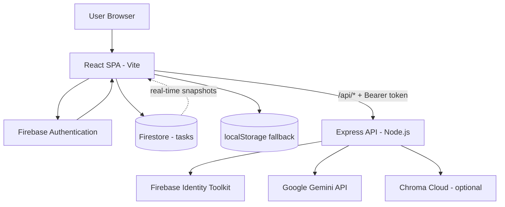
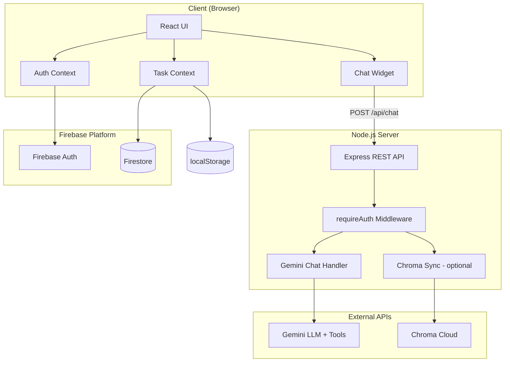
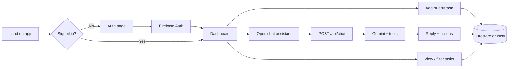

# To-Do Task Manager

A full-stack task management web application with secure authentication, cloud persistence, and an AI assistant that can read and modify tasks through natural language.

---

## Project Overview

### Project name

**To-Do Task Manager** (`todo-task-manager`)

### Purpose of the application

This application helps people capture, organize, and complete personal or professional tasks in one place. It combines a familiar to-do list interface with an AI-powered assistant so users can manage work through both traditional UI controls and conversational commands.

### Problem being solved

Many people juggle tasks across notes, email, and memory. Generic lists lack structure (priorities, due dates, views), and standalone chatbots cannot safely act on a user’s real task data. This project addresses that gap by:

- Storing tasks per user in a secure, cloud-backed database
- Offering structured views (Inbox, Today, Upcoming, Filters)
- Letting an AI assistant answer questions about tasks and perform create/update/delete/complete actions on the user’s behalf—only after authentication and with server-side API key protection

### Key features

| Feature | Description |
|--------|-------------|
| **User authentication** | Email/password and Google Sign-In via Firebase Auth |
| **Task CRUD** | Create, edit, delete, and mark tasks complete with title, description, due date, and priority |
| **Smart views** | Inbox, Today, Upcoming, and filterable task lists |
| **Real-time sync** | Firestore listeners keep the UI in sync when rules are published |
| **Offline-friendly fallback** | If Firestore rules are not published, tasks persist in browser local storage for the signed-in user |
| **AI task assistant** | Floating chat widget powered by Google Gemini with function calling |
| **Secured API** | Chat and optional vector sync require a valid Firebase ID token |
| **Semantic search (optional)** | Chroma Cloud stores task embeddings for RAG/sync; chat uses fast keyword matching by default |
| **Health checks** | API reports Gemini and Chroma configuration status |

### Intended users

- **Students and professionals** who want a simple daily task workflow
- **Developers** learning full-stack React, Firebase, and LLM integration patterns
- **Clients or instructors** reviewing a portfolio-ready demo with auth, persistence, and AI features
- **Maintainers** extending the app with new views, integrations, or deployment pipelines

---

## Technology Stack

| Category | Technology | Role in this project |
|----------|------------|----------------------|
| **Frontend framework** | [React](https://react.dev/) 19 | UI components, hooks, and client-side logic |
| **Build tool** | [Vite](https://vite.dev/) 8 | Dev server, HMR, production bundling |
| **Language** | TypeScript | Type-safe frontend and server code |
| **Backend framework** | [Node.js](https://nodejs.org/) + [Express](https://expressjs.com/) 5 | REST API (`/api/health`, `/api/chat`, `/api/tasks/sync`) |
| **Database** | [Firebase Firestore](https://firebase.google.com/docs/firestore) | Primary task storage at `users/{userId}/tasks/{taskId}` |
| **Local fallback storage** | `localStorage` (custom wrapper) | Per-user task cache when Firestore is unavailable |
| **Vector database (optional)** | [Chroma Cloud](https://www.trychroma.com/) | Task embeddings for semantic search and sync |
| **Authentication** | [Firebase Authentication](https://firebase.google.com/docs/auth) | Email/password + Google popup sign-in |
| **Token verification (server)** | Firebase Identity Toolkit `accounts:lookup` | Validates Bearer tokens without a service-account file |
| **LLM / API integration** | [Google Gemini](https://ai.google.dev/) via `@google/genai` | Chat, embeddings, and function calling |
| **Hosting / deployment** | *Not pre-configured in repo* | Local dev: Vite (5173) + Express (3001). Production typically uses **Firebase Hosting** (static) + **Cloud Run**, **Railway**, **Render**, or similar for the API |
| **State management** | React Context API | `AuthProvider` (`authStore`) and `TaskProvider` (`taskStore`) |
| **UI libraries** | None (custom CSS) | Styling in `src/styles/app.css` |
| **HTTP client** | Native `fetch` | `authFetch` attaches refreshed Firebase ID tokens |
| **Dev orchestration** | `concurrently` | Runs API and web together via `npm run dev` |
| **Other services** | Firebase Console, Google AI Studio, Chroma Cloud | Auth, rules, API keys, vector tenant/database |

### Important third-party services

1. **Firebase** — Auth, Firestore, security rules (`firestore.rules`)
2. **Google Gemini API** — Chat model and embedding model (keys only on server)
3. **Chroma Cloud** — Optional vector store for task sync/RAG (keys only on server)

---

## System Architecture

### High-level architecture

The system follows a **classic client–server split**:

- The **React SPA** handles authentication UI, task lists, and the chat widget.
- The **Express API** holds secrets (Gemini, Chroma) and performs AI inference and optional embedding sync.
- **Firestore** is the system of record for tasks when security rules are published.
- **Chroma** is an optional enhancement for vector search; the live chat path uses in-memory keyword matching over the task list sent from the client for reliability and speed.

### Client–server communication

- In development, Vite proxies `/api/*` to `http://localhost:3001` (see `vite.config.ts`).
- The browser calls `/api/health` without auth and `/api/chat` (and optionally `/api/tasks/sync`) with `Authorization: Bearer <Firebase ID token>`.
- Task payloads for chat include the user’s current task list so the model can reference real IDs.

### Data flow

1. User signs in → Firebase Auth issues an ID token.
2. `TaskProvider` subscribes to `users/{uid}/tasks` in Firestore (or falls back to local storage).
3. User creates/edits tasks → optimistic UI update → `persistTask` / `persistRemove` writes to Firestore or local storage.
4. User opens chat → client sends `message`, `history`, and `tasks` to `/api/chat`.
5. Server builds context (keyword-relevant tasks + full list), calls Gemini with tool definitions.
6. Server returns `reply` and structured `actions` → client applies actions via `taskStore` (create/update/delete/toggle).

### API flow

| Endpoint | Auth | Purpose |
|----------|------|---------|
| `GET /api/health` | No | Liveness and config flags (`geminiConfigured`, `chromaCloud`) |
| `POST /api/chat` | Bearer token | Gemini chat + function calling → `{ reply, actions, contextTaskIds }` |
| `POST /api/tasks/sync` | Bearer token | Upsert task embeddings into Chroma (best-effort; failures return soft skip) |

### Authentication flow

1. User submits credentials or clicks **Continue with Google** on `AuthPage`.
2. Firebase Auth establishes a session; `onAuthStateChanged` updates `AuthProvider`.
3. Protected routes render `TodoApp` only when `user` is non-null.
4. For API calls, `authFetch` calls `user.getIdToken(true)` and sends the JWT to Express.
5. `requireAuth` middleware calls `verifyFirebaseIdToken`, which posts to Identity Toolkit with `FIREBASE_API_KEY`.
6. On success, `req.userId` is set to the Firebase `uid` for user-scoped logic.

### Background jobs and scheduled tasks

This project **does not** use cron jobs, workers, or queues. All processing is **request-driven**:

- Task reads/writes happen on user interaction or Firestore snapshot updates.
- Chroma sync runs only when something calls `POST /api/tasks/sync` (optional; not required for core chat).
- The dev script `scripts/wait-for-api.mjs` polls `/api/health` once at startup so Vite starts after the API is ready.

### External integrations



### Architecture diagram (simplified layers)



---

## Functional Flow and User Journey

### 1. First visit and sign-in

1. User opens the app → `AuthPage` is shown while unauthenticated.
2. User signs in with **Google** or **email/password**.
3. Firebase session is established; the main dashboard (`TodoApp`) loads inside `TaskProvider`.

### 2. Managing tasks manually

1. User selects a view: **Inbox**, **Today**, **Upcoming**, or **Filters**.
2. User clicks **+ New task** or **+ Add task** → `TaskModal` opens.
3. On save, `createTask` optimistically updates the list and persists to Firestore (or local fallback).
4. User can check off tasks, edit, or delete from `TaskRow` / modal flows.
5. If Firestore rules are missing, a setup banner explains how to publish `firestore.rules`; tasks still work locally.

### 3. Using the AI assistant

1. User opens the chat FAB (bottom-right).
2. `ChatWidget` checks `/api/health` for API and Gemini availability.
3. User types a message or selects a quick prompt (e.g. “What are my high-priority tasks today?”).
4. Client sends authenticated request with recent history and full task list.
5. Server invokes Gemini with tools: `create_task`, `update_task`, `delete_task`, `toggle_task_done`.
6. Assistant reply appears in the chat; any returned `actions` are applied through `applyChatActions` → `taskStore`.
7. UI updates immediately; persistence follows the same Firestore/local path as manual edits.

### 4. Optional vector sync (advanced)

1. Client may call `POST /api/tasks/sync` with the current task array (e.g. via `syncTasks` in `src/features/chat/api.ts`).
2. Server embeds task text with Gemini embeddings and upserts into Chroma scoped by `userId` metadata.
3. Failures are non-fatal; chat continues using keyword context from the client-provided tasks.

### User journey diagram



---

## Project Structure

```
todo-task-manager/
├── src/                    # React frontend
│   ├── features/
│   │   ├── auth/           # AuthPage, authStore
│   │   ├── tasks/          # TaskList, TaskModal, taskStore
│   │   └── chat/           # ChatWidget, API client, action applier
│   ├── lib/                # Firebase, Firestore, API client, repositories
│   ├── components/         # Shared UI (banner, sidebar)
│   └── styles/             # Global CSS
├── server/                 # Express API
│   ├── auth/               # Firebase token verification
│   ├── gemini/             # Chat, embeddings, tools, model fallback
│   ├── chroma/             # Vector client, sync, search
│   └── middleware/         # requireAuth
├── shared/                 # Shared TypeScript types (Task, ChatAction)
├── scripts/                # wait-for-api.mjs
├── firestore.rules         # Security rules (publish in Firebase Console)
├── firebase.json           # Firebase project config
├── vite.config.ts          # Dev proxy to API
└── .env.example            # Environment variable template
```

---

## Getting Started

### Prerequisites

- **Node.js** 20 or newer
- A **Firebase** project with Authentication and Firestore enabled
- A **Google AI Studio** API key for Gemini
- (Optional) **Chroma Cloud** credentials for vector sync

### Installation

```bash
git clone <repository-url>
cd todo-task-manager
npm install
```

### Environment configuration

Copy the example file and fill in your values:

```bash
cp .env.example .env
```

| Variable | Description |
|----------|-------------|
| `GEMINI_API_KEY` | Server-only Gemini API key |
| `GEMINI_MODEL` | Chat model (default: `gemini-2.5-flash-lite`) |
| `GEMINI_EMBEDDING_MODEL` | Embedding model for Chroma sync |
| `FIREBASE_API_KEY` / `VITE_FIREBASE_*` | Firebase web config (client + token verification) |
| `CHROMA_*` | Chroma Cloud tenant, database, collection (optional) |

Never commit `.env` to version control.

### Firebase setup

1. Enable **Email/Password** and **Google** in Authentication → Sign-in method.
2. Create a Firestore database.
3. Publish rules from `firestore.rules` (Console → Firestore → Rules → Publish).
4. Ensure `localhost` is in Authentication → Authorized domains for local development.

### Run locally

```bash
npm run dev
```

| Service | URL |
|---------|-----|
| Web | http://localhost:5173/ |
| API health | http://localhost:3001/api/health |

`npm start` is an alias for `npm run dev`. The web process waits for the API to respond before starting Vite.

### Production build

```bash
npm run build    # TypeScript check + Vite build → dist/
npm run preview  # Preview static build (API still needed for chat)
```

Deploy `dist/` to static hosting and run the Express server separately with the same environment variables.

---

## API Reference

### `GET /api/health`

Response example:

```json
{
  "ok": true,
  "geminiConfigured": true,
  "geminiModel": "gemini-2.5-flash-lite",
  "chromaCloud": true
}
```

### `POST /api/chat` (authenticated)

**Headers:** `Authorization: Bearer <Firebase ID token>`

**Body:**

```json
{
  "message": "Create a high priority task for tomorrow called Submit report",
  "history": [{ "role": "user", "content": "..." }],
  "tasks": []
}
```

**Response:**

```json
{
  "reply": "I've added that task for you.",
  "actions": [{ "type": "create_task", "payload": { "title": "Submit report", "priority": "high", "dueDate": "2026-06-04" } }],
  "contextTaskIds": []
}
```

### `POST /api/tasks/sync` (authenticated)

**Body:** `{ "tasks": Task[] }`

Upserts embeddings into Chroma for the authenticated user. Returns `{ synced, skipped?, reason? }` on partial failure.

---

## Security Notes

- Gemini and Chroma credentials exist **only** in server-side `.env`.
- Firebase web API keys in `VITE_*` are public by design; security relies on **Firestore rules** and **Auth**.
- Protected routes reject missing or invalid Bearer tokens with `401`.
- Firestore rules restrict access to `users/{userId}/tasks` where `request.auth.uid == userId`.

---

## Troubleshooting

| Symptom | Likely cause | What to do |
|---------|----------------|------------|
| Chat says API not running | Express not started | Run `npm run dev` (both api + web) |
| `GEMINI_API_KEY is missing` | Empty server env | Set key in `.env` and restart API |
| Tasks not in cloud / permission error | Rules not published | Publish `firestore.rules`; until then, local fallback works |
| Empty Today/Upcoming | No due date on tasks | Use **Inbox** or set due dates on tasks |
| `401` on chat | Expired session | Sign out and sign in again |
| Gemini quota errors | Model limits | Use `gemini-2.5-flash-lite` or retry later; server tries fallback models |

---

## License and attribution

This project was built as an educational full-stack demonstration integrating React, Firebase, Express, Gemini, and optional Chroma Cloud. Extend and deploy it according to your course, client, or product requirements.

For questions about structure or extension points, start with `src/App.tsx`, `server/index.ts`, and `shared/task.ts`.
